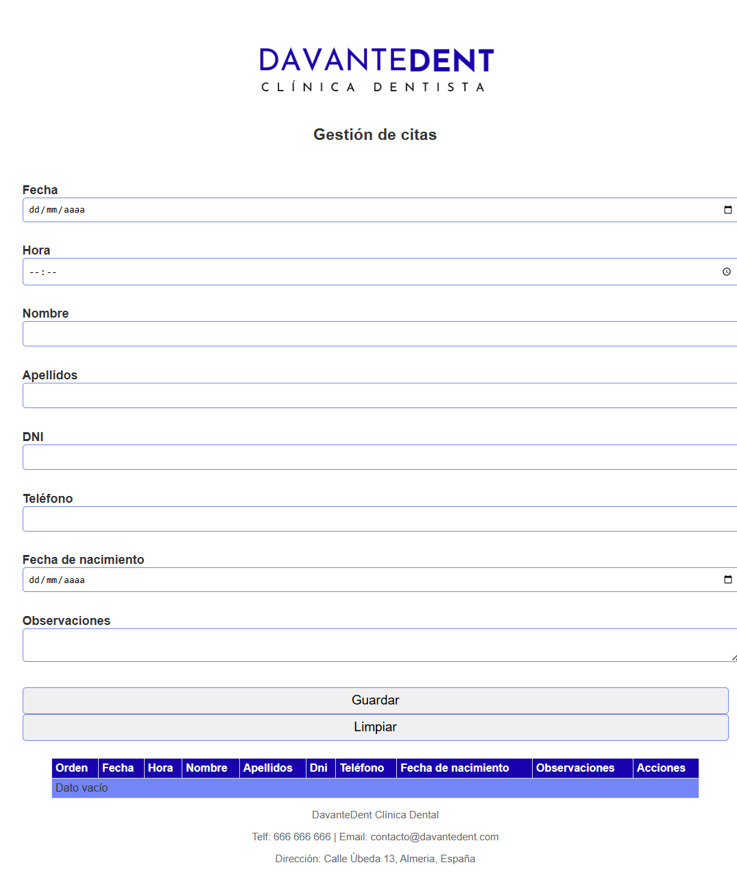

# DavanteDent — Gestión de Citas

Proyecto académico de **Desarrollo Web en Entorno Cliente**. Esta aplicación permite la **gestión de citas de pacientes**, con un formulario interactivo, 
tabla de citas y almacenamiento local en cookies. Implementado con **HTML, CSS y JavaScript puro**.

## 🌐 Vista previa
  


## 📁 Estructura del proyecto
- `index.html` → Página principal
- `style.css` → Estilos CSS
- `script.js` → Lógica de JavaScript
- `capturas/` → Imágenes de ejemplo y logotipo
- `_Logotipo davantedent.png` → Logotipo del proyecto

## 🛠 Tecnologías utilizadas
- HTML5
- CSS3
- JavaScript (Vanilla)
- Almacenamiento local con Cookies

## 🚀 Cómo usar
1. Clona este repositorio:
   ```bash
   git clone https://github.com/auroraaviz/DavanteDent---Gesti-n-de-citas.git
